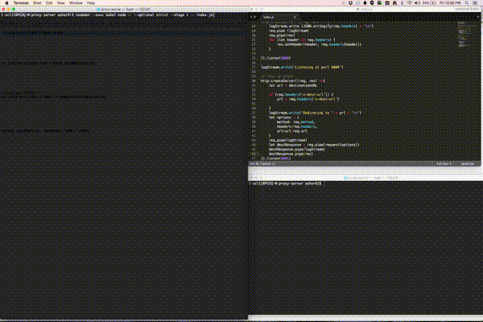

#This is the proxy server built using node.js

Features:

1.	Echo server runs on port 8000
2.	Proxy server is running on port 8001  and the destination server can be specified as   --host, --port or --url arguments or  x-dest-url header
3.	Requests and respones are printed to stdout by default
4.	The --logfile argument outputs all logs to the file specified instead of stdout
 

